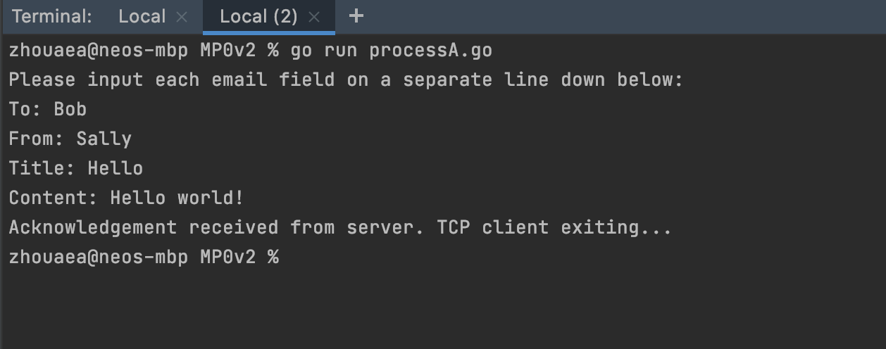
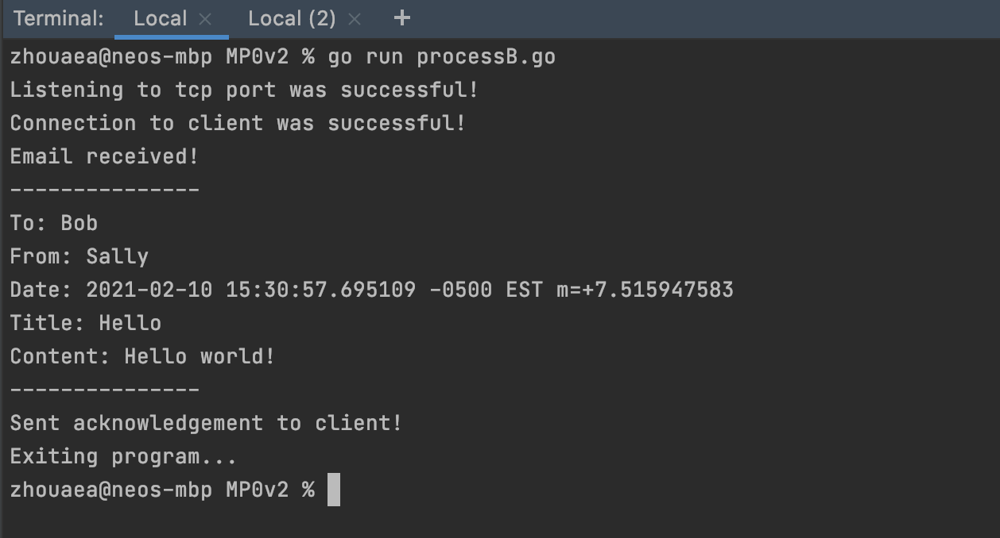

## MP0
MP0 uses a TCP channel to allow two processes written in Go to communicate with eachother in an email format.

I am using this project to practice coding in Go and learn how to do network programming.

## Screenshots
**Process A:**


**Process B:**


## How to Run
1. Start the TCP server in one shell.
```bash 
go run processB.go
```
2. Start the TCP client in another.
```bash 
go run processA.go
```
3. Follow printed instructions of TCP client in terminal.

## Credits
- My error checking function, `CheckError()`, is a modified version of sample code from [Network Programming with Go](https://ipfs.io/ipfs/QmfYeDhGH9bZzihBUDEQbCbTc5k5FZKURMUoUvfmc27BwL/socket/tcp_sockets.html).
- My exact implementation of establishing a TCP connection on both client and server side was taken from [this linode tutorial](https://www.linode.com/docs/guides/developing-udp-and-tcp-clients-and-servers-in-go/).